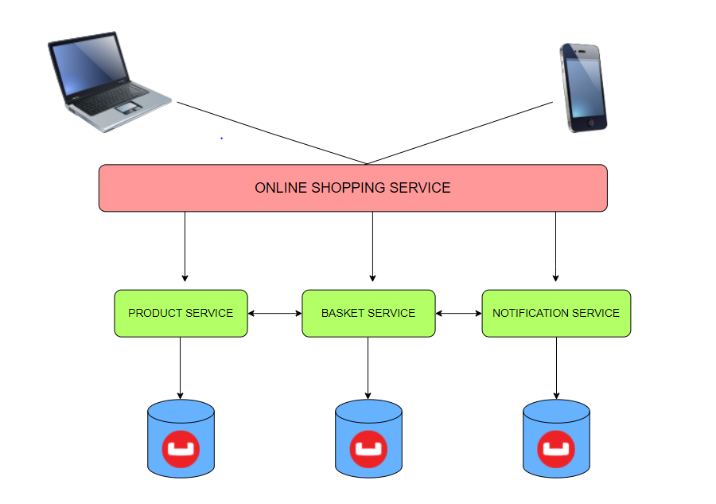

## **DESCRIPTION**
**This microservice is the second step of my individual project at the end of Trendyol Bootcamp.** 

**This service is responsible for adding products to the basket, removing them from the basket, calculating their prices and promotions within the basket domain I have set up. RestApi is written over port 9091. Adding products to the cart, removing the cart can be viewed.** 

**The main purpose of this service is to organize the basket and to calculate an accurate price with promotions. The business logic of the users' basket is written under BasketService.**

**2 promotions are defined for users to use, these are the shipping promotion and the fifty percent promotion. These variables are defined in the application.properties file so that the activation of these campaigns can be changed easily from the outside or, for example, they can be easily configured when the price of the cargo discount changes. In addition to these promotions, FactoryPattern is used to make it easier to add other promotions in the future. Promotions are held on the products. Before the Basket service adds a product, it sends an Http request to the product service and pulls the product whose id is given. So it can understand which promotion it is in or not.** 

**Couchbase is used as database in this service. The reason for this is to increase performance and scalability by using NoSql.**

**Operations that mean business logic in Basket Service are tested with Mockito using Unit Test. The application is dockerized with the Dockerfile I wrote. A 3-step (build, package, test) pipeline was created during the Gitlab installation phase.**

